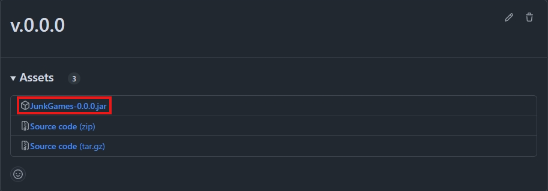
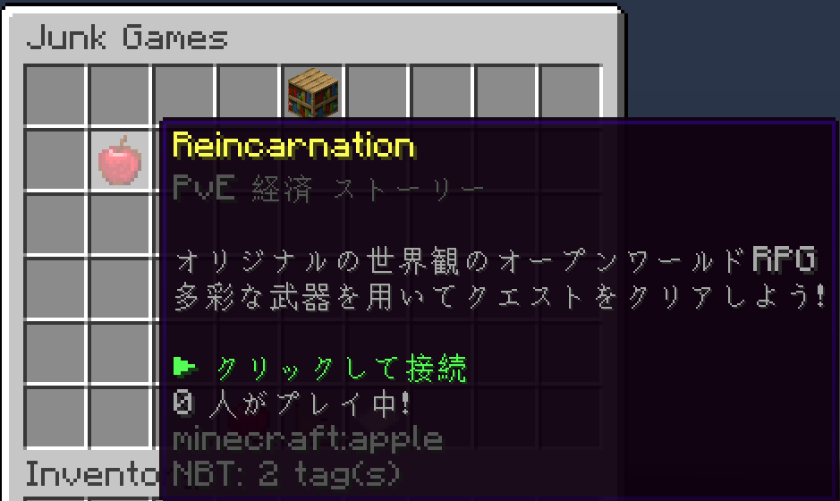

# Junk Games Core

Junk Games Core System

## Overview

Junk Games Coreは、 [アジ鯖](https://www.azisaba.net) のJunk Gamesサーバーの基幹システムとして開発されたSpigot プラグインです：

```yaml
Version: 0.2.3
Minecraft: 1.17.1
```

Junk Games (以下 JG)では、1サーバー内で複数のゲームを提供するため、ゲームを開発する際には、別のゲームに干渉しないよう設計する必要があります。

ゲーム開発者はJunk Games Coreで提供されるSDKを使用することで、他ゲームへの影響を考えることなく、プラグインの開発に取り組むことができるようになります。

このREADMEでは、SDKの使用方法を中心に、Junk Games Coreについてまとめています。

## 依存関係の解決

まずは、プロジェクトにSDKを追加します。

### 1. jarファイルのダウンロード

[リリース](https://github.com/AzisabaNetwork/JunkGamesCore/releases) から最新のビルドをダウンロードしてください。



### 2. 依存関係の追加

プロジェクトルートに任意の名前で (ここでは`jar`) ディレクトリを作成し、ダウンロードしたjarファイルを配置します。

#### Dependencies:

```groovy
compileOnly fileTree(dir: 'jar')
```

### 3. 依存関係の明示

依存関係を明示的に宣言し、Junk Games Coreよりも先にプラグインがロードされることのないように `plugin.yml` に以下の項目を追加します。

```yaml
depend:
  - JunkGames
```

## SDKを使用したメインクラス

通常、Spigotプラグインのメインクラスは `org.bukkit.plugin.java.JavaPlugin` を継承して作成しますが、

```java
public final class Example extends JavaPlugin {}
```

SDKを使用した開発では、代わりに `net.azisaba.jg.sdk.JunkGame` を継承します。

```java
public final class Example extends JunkGame {}
```

この `JunkGame` は `JavaPlugin` を継承しているため、通常のプラグインと同様にコードを書くことができますが、
`JunkGame` では同時に `IJunkGame` も継承しているために、加えていくつかの実装を行う必要があります：

```java
// 表示名を定義します (ゲームタイトルには緑色を推奨)
@NotNull Component getDisplayName();

// faviconを定義します
@NotNUll Material getFavicon();

// カテゴリーを定義します (複数指定するには半角スペースで区切ります)
@NotNull String getCategory();

// loreを定義します
@NotnUll List<Component> getLore();

// 優先度を定義します (ゲームの選択画面での表示順序に影響します)
int getPriority();

// 接続コマンドが呼び出されたときの処理を書きます
void onJunkGameCommand(Player player);
```

ここで定義したプラグインのメタ情報は、特にプレイヤーが直接的に視認するパート(例: ゲームの選択画面)で使用されます。

ゲームの特徴を簡潔に表現できるよう、適切な値を設定してください。



また、「接続コマンド」は、プラグインの起動時にJunk Games Coreによってゲーム名(プラグイン名)で`junkgames`の名前空間を使用して登録されるコマンド
のことを指します。

これらのコマンドは、通常ゲームに接続するために使用するものです。

従って、`JunkGame#onJunkGameCommand(Player)`には、ゲームのロビーに転送するなどといった**ゲームへの接続処理**を実装するようにしてください。

### 使用するワールドの宣言

Junk Games Coreは、ゲーム間の干渉を起こさないために、サーバー内のワールドの管理を行います。

Junk Game Coreによるワールドパーティションを実現するために、ゲームは、SDKを通して使用するワールドを明示的に宣言する必要があります。

`JunkGame#addWorld(String)`または`JunkGame#addWorld(World)`を使用できます：

```java
@Override
public void onEnable()
{
    // ワールド名で指定
    this.addWorld("world");
    
    // ワールドインスタンスで直接指定
    this.addWorld(Bukkit.getWorld("world"));
}
```

> [!NOTE]  
> 使用するワールドの追加は、`onEnable`外でも行うことができますが、特別な理由がなければ避けるようにしてください

### イベント API

> [!NOTE]
> Junk GamesのSDKには、Bukkitのイベント APIとは別に独自のAPIが実装されています

#### 使用方法

リスナークラスは、 `net.azisaba.jg.sdk.event.JunkGameListener` を実装することで定義できます。

また、ハンドラーメソッドには `net.azisaba.jg.sdk.event.JunkGameHandler` を付与し、
引数に `net.azisaba.jg.sdk.event.JunkGameEvent` を継承した実装クラスを1つ指定します。

```java
public class ExampleListener implements JunkGameListener
{
    @JunkGameHandler
    public void onEvent(JunkGameEvent event) {}
}
```

作成したリスナークラスは、 `JunkGame#addListener(JunkGameListener)` を使用して登録する必要があります：

```java
@Override
public void onEnable()
{
    this.addListener(new ExampleListener());
}
```

このように、Bukkit のイベントAPIと殆ど同じように使用することができます。

#### 利用可能なイベント

> [!IMPORTANT]
> Bukkit のイベント (`org.bukkit.event.*`) と同名のイベンドが存在します
> パッケージが `net.azisaba.jg.sdk.event.*` であるか注意するようにしてください

|      イベント名      | 詳細                                  |
|:---------------:|:------------------------------------|
| PlayerJoinEvent | プレイヤーがゲーム(= 宣言したワールド)に参加したときに発生します。 |
| PlayerQuitEvent | プレイヤーがゲームから退出したときに発生します。            |
| PlayerChatEvent | プレイヤーがゲーム内でチャットをしたときに発生します。         |

> [!IMPORTANT]
> プレイヤー参加時及びプレイヤー退出時の処理は、Bukkitの`PlayerJoinEvent`, `PlayerQuitEvent`ではなく、
> 必ずSDKのものを使用するようにしてください。

> [!NOTE]
> SDKのイベント APIで実装されていないイベントに関しては、特別な理由がなければ `JunkGame#isPlayer(Player)` を使用してゲームのプレイヤーかどうかを判定してから処理を行うようにしてください。

### コマンド

サーバー全体で使用できるコマンドは最小限に抑えられるべきです。

これは、ゲーム外から実行できてしまうことで他のゲームに予期せぬ影響を与えかねないためです。

ゲーム外から実行できる必要のないコマンドの処理クラスについては、 `org.bukkit.command.CommandExecutor` の代わりに `net.azisaba.jg.sdk.JunkGameCommand` を継承するようにしてください。

`JunkGameCommand` を使用することで、ゲーム内のみで実行可能になるほか、ゲーム外ではタブ補完にも表示されなくなります。

CommandExecutorと書き方が違うことに注意してください。

Bukkitへのコマンドの登録は通常のコマンドと同様で構いません。

```java
public class ExampleCommand extends JunkGameCommand
{
    @Override
    public @NotNull String getName()
    {
        // コマンドの登録名を定義します
        return "example";
    }
    
    @Override
    public @NotNull IJunkGame getProvider()
    {
        // コマンド提供元の JunkGame インスタンスを定義します
        return ExampleJunkGame.getInstance();
    }
    
    @Override
    public boolean execute(@NotNull CommandSender sender, @NotNull Command command, @NotNull String label, @NotNull String[] args)
    {
        // 処理メソッドには onCommand ではなく、execute を使用するようにしてください
    }
}
```

> [!NOTE]
> サーバー全体で使用できるコマンドを作成したいときは、通常通り CommandExecutor を使用してください
